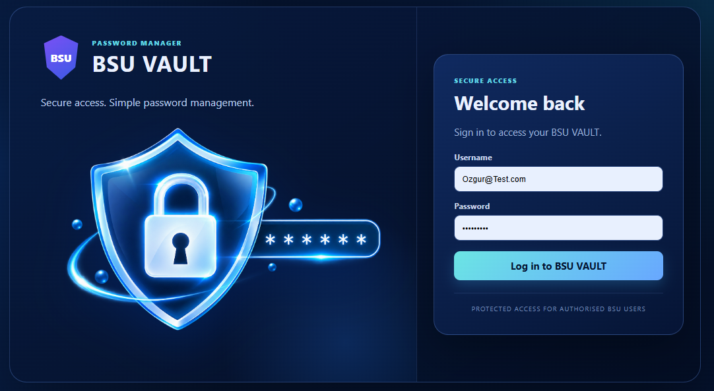

# 🔐 BSU VAULT

### Software Engineering Group Project — Team 1

  

BSU VAULT is a password manager prototype developed as part of the Team 1 Software Engineering group project.

The application is built with React and Vite and packaged as a Windows desktop application using Electron. It provides separate Administrator and Employee areas for managing employee accounts and password records.

---

## ✨ Features

### Administrator

- Administrator login and logout
- Create employee accounts
- Activate and deactivate employee accounts
- Delete employee accounts
- View employee information

### Employee

- Employee login and logout
- Add password records
- Edit password records
- Delete password records
- Search password records
- Show and hide passwords
- Copy password information
- Add notes to password records
- View password-age status

---

## 🛠️ Technologies

- React 19
- Vite 7
- Electron
- electron-builder
- JavaScript
- HTML
- CSS
- Local Storage
- Session Storage
- NSIS Windows Installer

---
## 🖥️ Desktop Application

BSU VAULT is also available as a Windows desktop application using Electron.

The React and Vite application is packaged with Electron and electron-builder. A Windows installer is generated using NSIS.

### Run the desktop application

~~~bash
npm install
npm run desktop
~~~

### Build the Windows installer

~~~bash
npm run dist:win
~~~

The Windows installer is available from the GitHub Releases section:

**BSU VAULT Desktop v1.0.0**

---

## 👥 Team 1

| Team Member | Role |
|---|---|
| Andreea | Team Leader / Project Management |
| Ramona | UI/UX |
| Shack | Developer |
| Sulman | Tester |
| Ozgur | Documentation Lead |

---

## 📁 Project Structure

~~~text
BSU_Vault/
├── electron/
│   └── main.cjs
├── src/
│   ├── assets/
│   ├── App.jsx
│   ├── index.css
│   └── main.jsx
├── index.html
├── package.json
├── package-lock.json
├── vite.config.js
├── .gitignore
└── README.md
~~~

---

## 🚀 Installation and Setup

### 1. Clone or download the repository

Download the project files or clone the repository to your computer.

### 2. Install dependencies

Open a terminal in the project folder and run:

~~~bash
npm install
~~~

### 3. Run the development version

~~~bash
npm run dev
~~~

Vite will display a local development address in the terminal.

### 4. Run the desktop application

~~~bash
npm run desktop
~~~

This builds the React/Vite application and opens BSU VAULT as an Electron desktop application.

### 5. Build the Windows installer

~~~bash
npm run dist:win
~~~

The generated Windows installer is placed in the `release` folder. The final installer is also available from the GitHub Releases section as **BSU VAULT Desktop v1.0.0**.

---

## 🔄 Main Application Flow

~~~text
Login
  ↓
Role Check
  ↓
Administrator Area / Employee Vault
  ↓
Account or Password Management
  ↓
Data Stored Locally
  ↓
Logout
~~~

---

## 🧪 Testing and Quality Assurance

The project is reviewed through functional testing, usability checks, responsive design review and security evaluation.

Testing covers areas including:

- Authentication
- Employee account management
- Password record management
- Search functionality
- Password visibility
- Password-age status
- User data separation
- Responsive behaviour
- Accessibility observations
- Storage and security limitations

Testing evidence and project documentation are maintained separately as part of the Software Engineering assessment evidence.

---

## 🔒 Security Notice

BSU VAULT is an **educational prototype** and is not a production password manager.

The current version uses browser storage for prototype data. This approach supports demonstration of the application's workflow but does not provide production-level password security.

Only fictional test data should be used with this version.

A production implementation would require additional security controls such as:

- Secure server-side authentication
- Protected credential storage
- Password hashing
- Encryption
- Secure session management
- Appropriate access controls
- Audit and monitoring controls

---

## 📚 Project Documentation

The BSU VAULT Development Document records the software engineering process and supporting evidence, including:

- Project requirements and scope
- Team roles and responsibilities
- Project planning and milestones
- UI/UX design
- Technical implementation
- Testing and quality assurance
- Risk and security considerations
- Communication and collaboration
- Evidence traceability
- Project evaluation
- Individual reflection

---

## 👨‍💻 Team Responsibilities

### Andreea — Team Leader / Project Management
Responsible for project coordination, planning, milestone management and supporting the organisation of the team.

### Ramona — UI/UX
Responsible for reviewing the user interface, usability, responsive behaviour, consistency and accessibility considerations.

### Shack — Developer
Responsible for application development and technical implementation.

### Sulman — Tester
Responsible for software testing, quality assurance, defect identification and recording test results.

### Ozgur — Documentation Lead
Responsible for Development Document coordination, evidence organisation, documentation traceability, communication records and final document quality checks.

---

## 📌 Repository Purpose

This repository provides the source code for the BSU VAULT Software Engineering group project.

Project-management records, testing evidence, communication evidence and Development Document materials are maintained as supporting assessment evidence.

The GitHub repository should be considered together with the team's Development Document when reviewing the complete software engineering process.

---

## 🎓 Academic Project Information

**Module:** CPU5005-20 Software Engineering  
**Project:** BSU VAULT  
**Team:** Team 1  
**Project Type:** Software Engineering Group Project

---

## ⚠️ Prototype Status

BSU VAULT was created for educational and assessment purposes.

It demonstrates software engineering concepts including requirements, role-based functionality, interface design, implementation, testing, quality assurance, project documentation and team collaboration.

It should not be used to store real passwords or sensitive personal information.
